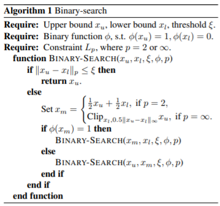
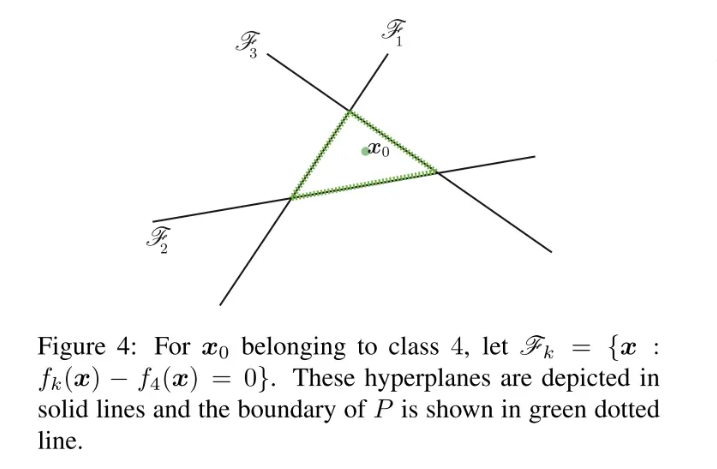
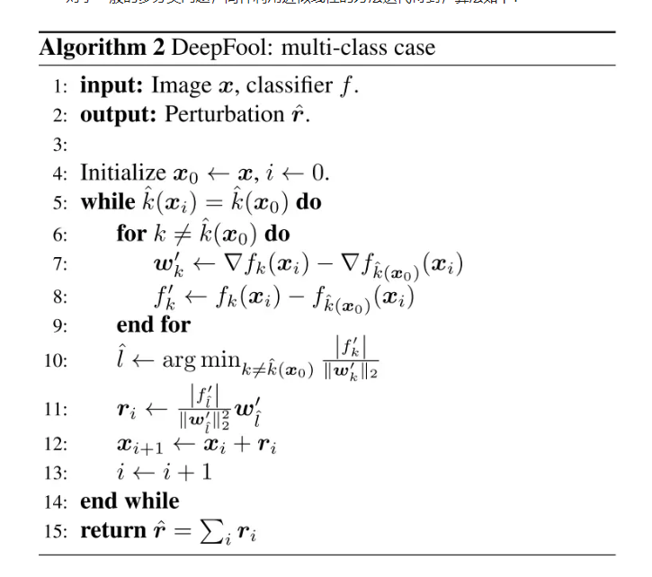
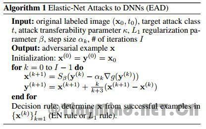
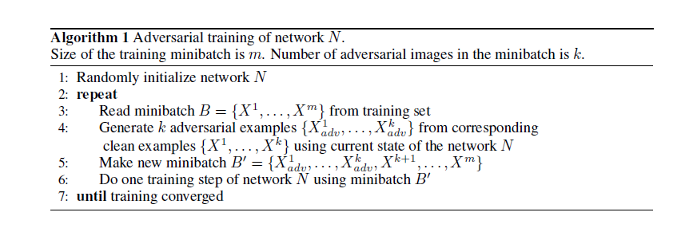
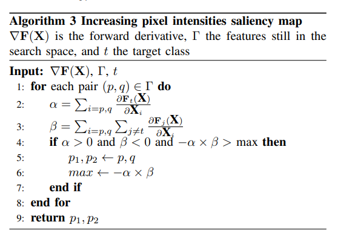
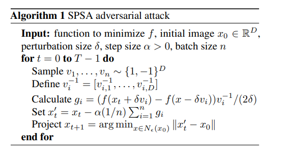
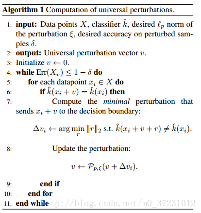
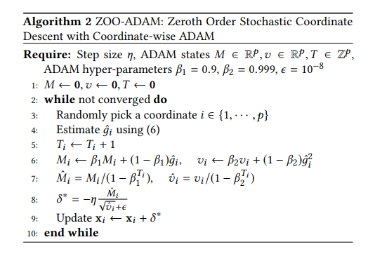
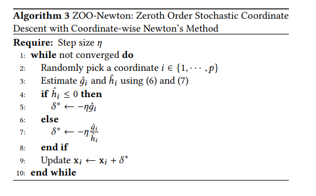

攻击算法详细介绍
================

平台已集成的攻击算法及简要说明如下所示(使用攻击算法缩写字典序排序)

名词解释
--------

攻击方法（黑白盒）
~~~~~~~~~~~~~~~~~~~~~~~~

白盒攻击
^^^^^^^^

项目的部分攻击算法是白盒的攻击方式，需要完整的知道model的结构和对应的梯度等信息。

黑盒攻击
^^^^^^^^

项目的部分攻击算法是黑盒的攻击方式，不需要完整的知道model的结构和对应的梯度等信息，只需要知道经过该模型的预测结果，用于作为评测的数据输入。

攻击方法（目标/非目标）
~~~~~~~~~~~~~~~~~~~~~~~~~~~~~

目标攻击
^^^^^^^^

目标攻击是指将原始样本通过攻击后，指定攻击后的结果类别

非目标攻击
^^^^^^^^^^

非目标攻击是指将原始样本通过攻击后，结果类别与原有的模型类别不同即可

BA算法
------

算法介绍
~~~~~~~~

BA的全称是 Boundary
Attack。该算法使用目标类中的一个样本初始化为非目标攻击，并用一个混合了均匀噪声的样本初始化为目标攻击。算法的每次迭代有三个部分。首先，通过二进制搜索将上次迭代的迭代结果推向边界。

|image1|

接着，通过如下方程估计梯度方向。

.. math::

   \widetilde{\triangledown S} (x^t, \delta):=\frac{1}{B} \sum_{b=1}^{B} \phi_x(x^t+\delta_{u_b})u_b

最后通过几何级数选择合适的步长，直到扰动成功。并通过二元搜索将扰动样本推回边界。

参数说明
~~~~~~~~

=================== ==================================
参数名称            参数说明
=================== ==================================
epsilon             扰动的步长系数
delta               重新缩放的扰动的尺寸
lower_bound         归一化数据上边界
upper_bound         归一化数据下边界
max_iter            扰动样本更新的最大内层迭代次数
binary_search_steps 搜索ε的迭代次数
batch_size          单次批处理大小
step_adapt          用来更新delta的更新系数
sample_size         过程中生成的潜在扰动样本的采样数目
init_size           初始化的随机样本数目
=================== ==================================

BIM算法
-------

.. _算法介绍-1:

算法介绍
~~~~~~~~

BIM全称为Basic Iterative Method。FGSM这种one-step
方法通过一大步运算增大分类器的损失函数而进行图像扰动，因而可以直接将其扩展为通过多个小步增大损失函数的变体，从而我们得到
Basic Iterative
Methods（BIM）。BIM是FGSM的拓展，进行了多次小步的迭代，并且在每一步之后都修剪得到的结果的像素值，来确保得到的结果在原始图像的
ϵ 邻域内，BIM迭代生成对抗样本的公式如下：

.. math::

   X_0^{adv}=X,\; \; X_{N+1}^{adv}=Clip_{X,\epsilon}\{ X_n^{adv} + \alpha sign(\triangledown _X J(X_N^{adv}, y_{true})) \}

.. _参数说明-1:

参数说明
~~~~~~~~

========= ======================
参数名称  参数说明
========= ======================
eps       原始样本的灰度偏移比例
eps_iter  梯度步长的改变比例
num_steps 多次迭代的次数
========= ======================

BLB算法
-------

.. _算法介绍-2:

算法介绍
~~~~~~~~

BLB的全称是 Box-constrained L-BFGS
attack。该攻击方法通过对图像添加小量的人类察觉不到的扰动误导神经网络做出误分类：

.. math::

   min_{\rho}|| \rho ||_2 \; s.t. C(I_c + \rho) = l;\; I_c + \rho \in [0,1]^m

其中Ic∈R\ :sup:`m表示一张干净的图片，ρ∈R`\ m是一个小的扰动，I是图像的label，C(…)是深度神经网络分类器。l和原本图像的label不一样。

但由于问题的复杂度太高，转而求解简化后的问题，即寻找最小的损失函数添加项，使得神经网络做出误分类，这就将问题转化成了凸优化过程。

.. math::

   min_{\rho} \; c|\rho| + L(I_c + \rho, l)\; \; s.t. I_c + \rho \in [0,1]^m

L(.,.)计算分类器的loss。通过凸优化的手段得到最终的噪音。

.. _参数说明-2:

参数说明
~~~~~~~~

=================== ==================================================
参数名称            参数说明
=================== ==================================================
init_const          二分搜索的参数的初始值，用于初始扰动图像的数据产生
binary_search_steps 二分搜索的一次循环步长
max_iter            使用LBFGS，torch的优化器优化扰动值的最大迭代次数
=================== ==================================================

Corrupt算法
-----------

.. _算法介绍-3:

算法介绍
~~~~~~~~

Corrupt算法将自然噪声加入到原始样本后所产生的攻击样本，用于评测模型的鲁棒性。其中，自然噪音（corruption）是指经常出现在自然场景中且对模型的任务产生一定不良影响的噪音，如：高斯噪音、强烈的对比度变化、雪、雾等。包含：

   gaussian_noise 高斯噪声

   shot_noise 散粒噪声（泊松噪声）

   impulse_noise 脉冲噪声

   speckle_noise 斑点噪声

   gaussian_blur 高斯模糊

   glass_blur 毛玻璃

   defocus_blur 散焦模糊

   motion_blur 运动模糊

   zoom_blur 缩放模糊

   Fog 烟雾

   Frost 水雾

   Snow 雪

   Spatter 喷溅

   Contrast 对比度噪声

   Brightness 过曝光

   Saturate 饱和

   jpeg_compression jpeg压缩产生的损失

   Pixelate 像素化

   elastic_transform 弹性变换

.. _参数说明-3:

参数说明
~~~~~~~~

======== ======================================================
参数名称 参数说明
======== ======================================================
severtiy 选择待选参数，1是第一个，2就是第二个，暂时不开放给用户
gama     决定迭代次数的和图像尺度大小相关的一个比例系数
======== ======================================================

CW2算法
-------

.. _算法介绍-4:

算法介绍
~~~~~~~~

CW2算法的全称是 Carlini & Wagner Attack。Carlini 和Wagner
为了攻击防御性蒸馏(Defensive
distillation)网络提出了三种对抗攻击方法，通过限制
l0,l1,l∞范数使得扰动无法被察觉。实验证明蒸馏网络完全无法防御这三种攻击。该算法生成的对抗扰动可以从unsecured网络迁移到secured网络上，从而实现黑箱攻击。实验表明，C&W攻击方法能有效攻击现有的大多数防御方法。

目标函数表示为：

.. math::

   min_{\delta} D(x,x+\delta)+c \cdot f(x+\delta)\, subject \; to \; x + \delta \in [0,1]

式中，δ 是对抗扰动；D(∙,∙)表示L0、L2或L∞距离度量；f(x
+δ)是自定义的对抗损失，当且仅当DNN的预测为攻击目标时才满足f(x
+δ)≤0。为了确保x + δ产生能有效的

图像（即x +δ ∈ [0, 1]），引入了一个新变量来代替δ：

.. math::

   \delta = \frac{1}{2}(tanh(K) + 1) - x

这样，x + δ =1/2(tanh(k) + 1)在优化过程中始终位于[0,
1]中。除了在MNIST、CIFAR10和ImageNet的正常训练DNN模型上获得100%的攻击成功率外，C&W攻击还可以破坏防御性蒸馏模型，而这些模型可以使L-BFGS和Deepfool无法找到对抗性样本。

.. _参数说明-4:

参数说明
~~~~~~~~

=================== ====================================
参数名称            参数说明
=================== ====================================
dataset             使用的数据集的名称
class_type_num      分类网络的类别
kappa               标签的序号的整体偏移量
learning_rate       迭代过程中优化器的学习率
init_const          初始的迭代求解参数的值
lower_bound         产生中间扰动样本的值的下边界
upper_bound         产生中间扰动样本的值的上边界
max_iter            为了生成合适的扰动样本时候的迭代次数
binary_search_steps 为了求解合适的参数的搜索迭代次数
=================== ====================================

Deepfool算法
------------

.. _算法介绍-5:

算法介绍
~~~~~~~~

对于多分类问题，通常采取的方案为一对多。在这里，针对多个输出类别，通过下式进行分类选择：

.. math::

   \hat{k}(x)=\underset{k}{arg\, max}f_k(x)

对于线性多分类器，我们有：

.. math::

   f(x)=W^Tx+b

最小扰动可以由下式计算：

.. math::

   \\ \underset{r}{arg\, min}\left |\left |r \right | \right |_2
   \\ s.t. \; \exists k: w_k^T(x_0 + r) + b_k \geq w_{\hat{k}(x_0)}^T(x_0+r)+b_{\hat{k}(x_0)}

为了解这个问题，我们先来看一个四分类问题的例子：

|image2|

注意，这里只有三条线，分别对应前三类的参数超平面与第四类相减得到的参数超平面。同样利用点到直线的距离公式，若求得到这三条线的最短距离便可得到使样本分类发生变化的最小扰动长度。最短距离可以用下式计算：

.. math::

   \hat{l}(x_0)=\underset{k\neq \hat{k}(x_0)}{arg \, min} \frac{\left| f_k(x_0) - f_{\hat{k}(x_0)}(x_0) \right |}{\left | \left | w_k - w_{\hat{k}(x_0)} \right | \right |_2}

因此最小扰动向量为：

.. math::

   r_*(x_0)=\frac{\left| f_{\hat{l}(x_0)}(x_0) - f_{\hat{k}(x_0)}(x_0) \right |}{\left | \left | w_{\hat{l}(x_0)} - w_{\hat{k}(x_0)} \right | \right |_2^2}(w_{\hat{l}(x_0)} - w_{\hat{k}(x_0)})

对于一般的多分类问题，同样利用近似线性的方法迭代得到，算法如下：

|image3|

注意，这个算法并不能保证收敛到最小扰动解。算法中2范数可以扩展到p范数。

.. _参数说明-5:

参数说明
~~~~~~~~

========= ====================================
参数名称  参数说明
========= ====================================
overshoot 防止算法收敛到分类面上
max_iter  为了生成合适的扰动样本时候的迭代次数
========= ====================================

EAD算法
-------

.. _算法介绍-6:

算法介绍
~~~~~~~~

EAD的全称是 Elastic-net Attacks to DNNs。EAD将使用对抗样本攻击 DNN
的过程转化为了使用弹性网络正则化（elastic-net
regularized）的优化问题。在这种表示下，当前最佳的 L2
范数攻击算法成为了本文方法的一个特例（在不考虑 L1 范数的情况下）。在
MNIST、CIFAR10 和 ImageNet 上的实验结果表明 EAD 算法可以生成具有很小 L1
失真的对抗样本，并且能在不同攻击场景中实现与当前最佳方法匹敌的攻击成功率。更重要的是，EAD
算法生成的对抗样本有着显著增强的攻击可迁移性，这为如何在对抗机器学习中使用
L1 范数失真以及增强 DNN
的安全性提供了全新的见解。下图是EAD算法的伪代码：

|image4|

.. _参数说明-6:

参数说明
~~~~~~~~

=================== ==============================
参数名称            参数说明
=================== ==============================
lr                  学习率
kapa                标签的偏移值
binary_search_steps 用来搜索合适的参数的迭代次数
init_const          初始化的调节系数
lower_bound         产生中间扰动样本的值的下边界
upper_bound         产生中间扰动样本的值的上边界
max_iter            扰动样本更新的最大内层迭代次数
class_type_number   分类类别的数目
beta                扰动样本的初始灰度波动值
EN                  决策规则的选择
=================== ==============================

FGSM算法
--------

.. _算法介绍-7:

算法介绍
~~~~~~~~

FGSM的全称是Fast Gradient Sign
Method(快速梯度下降法），在白盒环境下，通过求出模型对输入的导数，然后用符号函数得到其具体的梯度方向，接着乘以一个步长，得到的“扰动”加在原来的输入
上就得到了在FGSM攻击下的样本。

FGSM的攻击表达如下：

.. math::

   x^{'}=x+\varepsilon \cdot sign(\triangledown_x J(x, y))

攻击成功就是模型分类错误，就模型而言，就是加了扰动的样本使得模型的loss增大。而所有基于梯度的攻击方法都是基于让loss增大这一点来做的。可以仔细回忆一下，在神经网络的反向传播当中，我们在训练过程时就是沿着梯度方向来更新更新w，b的值。这样做可以使得网络往loss减小的方向收敛。

.. math::

   \\ W_{ij}^{(l)}=W_{ij}^{(l)}-\alpha \frac{\partial}{\partial  W_{ij}^{(l)}}J(W,b)
   \\ b_{i}^{(l)}=b_{i}^{(l)}-\alpha \frac{\partial}{\partial  b_{i}^{(l)}}J(W,b)

那么现在我们既然是要使得loss增大，而模型的网络系数又固定不变，唯一可以改变的就是输入，因此我们就利用loss对输入求导从而“更新”这个输入。

.. _参数说明-7:

参数说明
~~~~~~~~

======== ==================
参数名称 参数说明
======== ==================
epsilon  沿着梯度的步长系数
======== ==================

ILLC
----

.. _算法介绍-8:

算法介绍
~~~~~~~~

ILLC的全称是Iterative Least Likely Class Attack，先介绍一下
one-Step的方法。 one-step target class methods:

.. math::

   X^{adv}=x-\epsilon sign(\triangledown_{X}J(X,y_{target}))

其中

.. math::

   y_{target}=\underset{y}{argmin}p(y|X)

即偏离最远的错误类。这里产生的攻击样本是其中一个候选样本，当只计算完成一个梯度的时候，一般是通过线性扰动的损失函数，而迭代方式可以应用更多的梯度更新，它们通常不依赖于模型的任何近似值，并且在进行更多迭代时通常会产生更多有效果和攻击性的对抗样本（图像），也就是说ILLR迭代方式是one-Step的“升级版”。

.. math::

       X_0^{adv} = X,X_{N+1}^{adv}=Clip_{X,\epsilon}(X_N^{adv}-\alpha sign(\triangledown_{X}J(X_N^{adv}, y_{target})))

损失函数是：

.. math::

       Loss=\frac{1}{(m-k)+\lambda k}\left (\sum_{i \in CLEAN}L(X_i|y_i)+\lambda \sum_{i \in ADV}L(X_i^{adv}|y_i)  \right )

其中L(X|y)是单个样本X对于真实标记y的损失函数，m是小批量上的训练样本总数，k是小批量内对抗样本的数目而λ是参数来控制对抗样本对于损失函数的权重。

算法过程：

|image5|

.. _参数说明-8:

参数说明
~~~~~~~~

============ ====================
参数名称     参数说明
============ ====================
epsilon      样本归一化的偏移比例
epsilon_iter 沿着梯度的步长系数
num_steps    迭代次数
============ ====================

JSM
---

.. _算法介绍-9:

算法介绍
~~~~~~~~

JSM算法的全称是Jacobian-based Saliency Map Attack

目标是只修改图像中的几个像素，而不是扰乱整个图像来欺骗分类器,该算法一次修改一个干净图像的像素，并监测变化对结果分类的影响。通过使用网络层的输出的梯度来计算一个显著性图来执行监控。

JSMA算法主要包括三个过程：计算前向导数，计算对抗性显著图，添加扰动，以下给出具体解释。

所谓前向导数，其实是计算神经网络最后一层的每一个输出对输入的每个特征的偏导。以MNIST分类任务为例，输入的图片的特征数（即像素点）为784，神经网络的最后一层一般为10个输出（分别对应0-9分类权重），那对于每一个输出我们都要分别计算对784个输入特征的偏导，所以计算结束得到的前向导数的矩阵为（10，784）。前向导数标识了每个输入特征对于每个输出分类的影响程度，其计算过程也是采用链式法则。这里需要说明一下，前面讨论过的FGSM和DeepFool不同在计算梯度时，是通过对损失函数求导得到的，而JSMA中前向导数是通过对神经网络最后一层输出求导得到的。前向导数∇F(X)具体计算过程如下所示，j表示对应的输出分类，i表示对应的输入特征。

.. math::

   \\ \triangledown F(X)=\frac{\partial F(X)}{\partial X}=\left [ \frac{\partial F_j(X)}{\partial x_i} \right ]_{i \in 1...M,j \in 1...N}
   \\ \frac{\partial F_j(X)}{\partial x_i}=\left( W_{n+1,j} \cdot \frac{\partial H_n}{\partial x_i} \right ) \times \frac{\partial f_{n+1,j}}{\partial x_i}\left( W_{n+1,j} \cdot H_n + b_{n + 1, j} \right )

通过得到的前向导数，我们可以计算其对抗性显著图，即对分类器特定输出影响程度最大的输入。首先，根据扰动方式的不同（正向扰动和反向扰动），作者提出了两种计算对抗性显著图的方式，即：

.. math::

   S(X,t)[i]= \left\{\begin{matrix} 0 & if \: \frac{\partial F_t(X)}{\partial X_i} < 0 \: or \: \sum_{j \neq t} \frac{\partial F_j(X)}{\partial X_i} > 0
   \\ \left( \frac {\partial F_t(X)}{\partial X_i} \left | \sum_{j \neq t} \frac{\partial F_j(X)}{\partial X_i} \right | \right ) & otherwise
   \end{matrix}\right.

但是在文章中第四部分的应用中作者发现，找到单个满足要求的特征很困难，所以作者提出了另一种解决方案，通过对抗性显著图寻找对分类器特定输出影响程度最大的输入特征对，即每次计算得到两个特征。

.. math::

   argmax_{p1,p2}\left( \sum_{i=p1,p2} \frac{\partial F_t(X)}{\partial X_i} \right) \times \left| \sum_{i=p1,p2} \sum_{j \neq t} \frac{\partial F_j(X)}{\partial X_i} \right |

算法具体过程：

|image6|

.. _参数说明-9:

参数说明
~~~~~~~~

+----------+----------------------------------------------------------+
| 参数名称 | 参数说明                                                 |
+==========+==========================================================+
| theta    | 样本一维度化之                                           |
|          | 后（拉平）对图像的灰度的增减。小于0是降低，大于0是增加。 |
+----------+----------------------------------------------------------+
| gama     | 决定迭代次数的和图像尺度大小相关的一个比例系数           |
+----------+----------------------------------------------------------+

LLC算法
-------

.. _算法介绍-10:

算法介绍
~~~~~~~~

LLC算法的全称为Least-Likely-Class Iterative Methods。

one-step
方法通过一大步运算增大分类器的损失函数而进行图像扰动，因而可以直接将其扩展为通过多个小步增大损失函数的变体，从而我们得到
Basic Iterative
Methods（BIM）。而该方法的变体和前述方法类似，通过用识别概率最小的类别（目标类别）代替对抗扰动中的类别变量，而得到
Least-Likely-Class Iterative Methods。

.. math::

   y_{LL}=\underset{y}{arg\, min} \{ p(y|X) \}

这里X是原始的图像，攻击样本：

.. math::

   X_0^{adv}=X, \; X_{N+1}^{adv}=Clip_{X,\epsilon}\{ X_N^{adv} - \alpha sign(\triangledown _X J(X_N^{adv}, y_{LL})) \}

.. _参数说明-10:

参数说明
~~~~~~~~

======== ==================
参数名称 参数说明
======== ==================
eps      沿着梯度的步长系数
======== ==================

NES算法
-------

.. _算法介绍-11:

算法介绍
~~~~~~~~

NES算法的全称为Nature Evolutionary Strategies

.. _参数说明-11:

参数说明
~~~~~~~~

=================== ================================================
参数名称            参数说明
=================== ================================================
learning_rate       学习率
lower_bound         产生中间扰动样本的值的下边界
upper_bound         产生中间扰动样本的值的上边界
max_iter            扰动样本更新的最大内层迭代次数
binary_search_steps 用来搜索合适的参数的迭代次数
batch_size          单次批处理数目
kappa               标签的序号的整体偏移量
sigma               随机样本分布的标准差
class_type_number   分类类别的数目
confidence          帮助判断攻击类别和预测类别是否相同或者有固定偏差
epsilon             扰动的步长系数
=================== ================================================

OM算法
------

.. _算法介绍-12:

算法介绍
~~~~~~~~

OM算法的全称为OPTMARGIN
attack，它可以生成低失真的对抗示例，对小扰动具有鲁棒性，例如在区域分类中使用的小扰动。

在OPTMARGIN攻击中，创建了区域分类器的替代模型，该模型干扰输入点比较少。

这里f是用来区域分类的点分类器，vi是作用在输入样本x上的扰动。该攻击使用现有的优化攻击技术来生成示例，愚弄整个过程的同时最大程度地减少其失真。

.. math::

   l_i(x^{'})=l(x^{'}+v_i)=max(-k, Z(x^{'} + v_i)_y - max\{ Z(x^{'} + v_i)_j : j \neq y \})

这里k=0，这意味着，只要能产生错分类，就可以接受。通过这些损失方程，作者扩展了Carlini＆Wagner的L2攻击，有：

.. math::

   minimize || x^{'} - x ||_2^2 + c \cdot (l_1(x^{'})+...+l_n(x^{'}))

作者选用了20种分类器，在攻击过程中，v1,v2,…,v19，都是量级归一化到ε上的随机正交向量，v20=0,此选择是为了使随机扰动位于vi中，为了稳定优化器，在攻击过程中，需要固定vi，这个办法在C&W算法中仍然使用过，详细的描述见：https://openreview.net/pdf?id=BkpiPMbA-

.. _参数说明-12:

参数说明
~~~~~~~~

=================== ==========================================
参数名称            参数说明
=================== ==========================================
lr                  学习率
kapa                标签的偏移值
binary_search_steps 用来搜索合适的参数的迭代次数
init_const          初始化的调节系数
lower_bound         产生中间扰动样本的值的下边界
upper_bound         产生中间扰动样本的值的上边界
max_iter            扰动样本更新的最大内层迭代次数
class_type_number   分类类别的数目
noise_count         中间扰动样本的数目，初始都是随机的正交向量
magnitude           扰动样本的归一化的正交向量的幅值
=================== ==========================================

PGD算法
-------

.. _算法介绍-13:

算法介绍
~~~~~~~~

PGD全称是Projected Gradient
descent。目的是为解决FGSM和FGM中的线性假设问题，使用PGD方法来求解内部的最大值问题。
PGD是一种迭代攻击，相比于普通的FGSM和FGM
仅做一次迭代，PGD是做多次迭代，每次走一小步，每次迭代都会将扰动投射到规定范围内。

.. math::

   g_t=\triangledown X_t(L(f_\theta (X_t), y))

gt 表示t时刻的损失关于t时刻输入的梯度。

.. math::

   X_{t+1} = \prod _{X+S}(X_t+\varepsilon (\frac{g_t}{|| g_t ||}))

t+1时刻输入根据t时刻的输入及t时刻的梯度求出。∏_(X+S)的意思是，如果扰动超过一定的范围，就要映射回规定的范围S内。

由于每次只走很小的一步，所以局部线性假设基本成立。经过多步之后就可以达到最优解，也就是达到最强的攻击效果。同时使用PGD算法得到的攻击样本，是一阶对抗样本中最强的。这里所说的一阶对抗样本是指依据一阶梯度的对抗样本。如果模型对PGD产生的样本鲁棒，那基本上就对所有的一阶对抗样本都鲁棒。实验也证明，利用PGD算法进行对抗训练的模型确实具有很好的鲁棒性。

PGD虽然简单，也很有效，但是存在一个问题是计算效率不高。不采用提对抗训练的方法m次迭代只会有m次梯度的计算，但是对于PGD而言，每做一次梯度下降（获取模型参数的梯度，训练模型），都要对应有K步的梯度提升（获取输出的梯度，寻找扰动）。所以相比不采用对抗训练的方法，PGD需要做m(K+1)次梯度计算。

.. _参数说明-13:

参数说明
~~~~~~~~

========= ======================
参数名称  参数说明
========= ======================
eps       原始样本的灰度偏移比例
eps_iter  梯度步长的改变比例
num_steps 迭代次数
========= ======================

RFGSM算法
---------

.. _算法介绍-14:

算法介绍
~~~~~~~~

RFGSM算法全称是RAND-FGSM (R-FGSM)

使用FGSM方法进行对抗训练后的神经网络模型，在面对白盒攻击时比黑盒攻击更为鲁棒，所以提出了R-FGSM
增加随机梯度训练，用于防御对抗训练。

.. math::

   \\ x_{tmp} = x+\alpha \cdot sign(N(0^d, I^d))
   \\ x^{'}=x_{tmp}+(\epsilon - \alpha)\cdot sign(\triangledown _ {x_{tmp}} J(x_{tmp}, l))

其中α 和 ϵ 是参数，且α<ϵ。

.. _参数说明-14:

参数说明
~~~~~~~~

+----------+----------------------------------------------------------+
| 参数名称 | 参数说明                                                 |
+==========+==========================================================+
| epsilon  | 沿着梯度方向步长的参数，当                               |
|          | 该值越大时，每次为样本添加的扰动更大，对抗攻击强度越高。 |
+----------+----------------------------------------------------------+
| alpha    | 梯度步长的改变比例。                                     |
+----------+----------------------------------------------------------+

RLLC算法
--------

.. _算法介绍-15:

算法介绍
~~~~~~~~

Random Least Likely Class Attack

.. _参数说明-15:

参数说明
~~~~~~~~

+----------+----------------------------------------------------------+
| 参数名称 | 参数说明                                                 |
+==========+==========================================================+
| epsilon  | 沿着梯度方向步长的参数，当                               |
|          | 该值越大时，每次为样本添加的扰动更大，对抗攻击强度越高。 |
+----------+----------------------------------------------------------+
| alpha    | 调节梯度步长系数的比例系数                               |
+----------+----------------------------------------------------------+

SPSA算法
--------

.. _算法介绍-16:

算法介绍
~~~~~~~~

SPSA算法全称是Multivariate stochastic approximation using a simultaneous
perturbation gradient approximation

SPSA算法非常适合于高维优化问题，即使在不确定目标的情况下，我们也可使用SPSA公式来产生对抗性攻击。在SPSA算法中，首先从Rademacher分布（即Bernoulli±1）中抽取一批n个样本，即

.. math::

   v1,...,vn ∈\{1, -1\}^D

然后用随机方向上的有限差分估计逼近梯度。具体来说，对于第i个样本，估计的梯度gi计算如下：

.. math::

   g_i=\frac{f(x_t+\delta v_i) - f(x - \delta v_i)}{2\delta v_i}

式中，δ是扰动大小，xt是第t次迭代时的扰动图像，f是要评估的模型。最后，SPSA对估计的梯度进行聚合，并在输入文本上执行投影梯度下降。整个过程按预先确定的迭代次数进行迭代。

完整的伪代码如下：

|image7|

.. _参数说明-16:

参数说明
~~~~~~~~

============= ==============================
参数名称      参数说明
============= ==============================
alpha         沿着梯度扰动的步长系数
gamma         扰动的系数
c_par         迭代的基准噪声系数
a_par         用来调整alpha系数的更新系数
sizeN         扰动样本更新的最大内层迭代次数
min_vals_iter 最小的loss值下界
print_every   迭代过程中多少次迭代后打印一次
max_iter      扰动样本更新的最大外层迭代次数
============= ==============================

UAP算法
-------

.. _算法介绍-17:

算法介绍
~~~~~~~~

UAP算法的全称是Universal Adversarial Perturbation attack。

UAP算法提出了一种不易察觉的万能perturbation，它能使目前最好的分类器，在完成图片分类任务时出错。通过这个算法得到的perturbation，在各种神经网络情况下都能取得很好的效果。这揭示了目前分类器分类“判定边界”在高维度上的几何关系。

万能perturbation的构造算法：

算法得到的perturbation需要满足两个条件：

.. math::

   \\ ||v||_p \leq \xi
   \\ \underset{x \sim u}{\mathbb{P}}(\hat{k}(x+v) \neq \hat{k}(x)) \geq 1 - \delta

即第一是扰动的规模要比较小，第二是原来的数据叠加了扰动之后，分类器的输出错误率要大于一个阈值。整体的算法如下：

|image8|

其算法思想是对于图片数据中的每一个点，依次计算能使得最终分类器的输出错误的最小扰动，一直循环知道将整体分类错误的概率大于
1 − δ，其中 δ
为人为定义的分类器准确度。而算法的关键不是为了找到一个能使大多数样本分类错误的最小perturbation，而是用足够小的范数找到这样的一个扰动。

.. _参数说明-17:

参数说明
~~~~~~~~

======== ================
参数名称 参数说明
======== ================
dataset  使用的数据集类别
======== ================

UMIFGSM算法
-----------

.. _算法介绍-18:

算法介绍
~~~~~~~~

UMIFGSM算法全称是Utargeted Momentum Iterative Fast Gradient Sign
Method(UMI-FGSM)。

在迭代攻击方法中加入动量项（momentum term），提高对抗样本的转移性：

.. math::

   \\ g_{t+1}=\mu \cdot g_t + \frac{\triangledown_x J(x_t^{adv}, y)}{|| \triangledown_x J(x_t^{adv}, y) ||_1}
   \\ x_{t+1}^{adv}=x_{t}^{adv}+\alpha \cdot sign(g_{t+1})

其中gt包含了直到t次迭代的梯度信息。

.. _参数说明-18:

参数说明
~~~~~~~~

============ ========================
参数名称     参数说明
============ ========================
epsilon      扰动的步长系数
eps_iter     调节扰动的步长的比例系数
num_step     扰动样本更新的迭代次数
decay_factor 调节动量项的步长
============ ========================

ZOO算法
-------

.. _算法介绍-19:

算法介绍
~~~~~~~~

ZOO算法全称为Zeroth Order Optimization Based Black-box。

ZOO攻击不可知，仅依赖于预测分数（例如类别机率或对数），使用数值估算梯度的预测。ZOO算法利用正负扰动带来的概率差估算一阶导（梯度）和二阶导，再利用ADAM或者牛顿法等方法更新x。本质为通过估算梯度将黑盒转换为白盒过程。

ZOO算法的损失函数和CW相似：

.. math::

   minimize_x ||x-x_0||_2^2+c\cdot f(x,t) \; \; subject \; to \; x \in [0,1]^p

损失函数如上，左边保证对抗样本与真实input的相似，右边保证对抗样本能导致目标模型出错，具体如下：

目标攻击下：

.. math::

   f(x,t)=max\{ \underset{i \neq t}{max} log[F(x)]_i - log[F(x)]_t, -K \}

非目标下

.. math::

   f(x)=max\{log[F(x)]_{t_0} - \underset{i \neq t}{max} log[F(x)]_i , -K \}

随机选取一个坐标

估计梯度，h非常小，ei是一个只有i-th元素等于1的偏置向量。第二个只在牛顿法中才会使用。

.. math::

   \\ \hat{g}_i :=\frac{\partial f(x)}{\partial x_i} \approx \frac{f(x+he_i) - f(x - he_i)}{2h}
   \\ \hat{h}_i := \frac{\partial ^2 f(x)}{\partial x_{ii}^2} \approx \frac{f(x+he_i) - 2f(x) + f(x - he_i)}{h^2}

|image9|

|image10|

.. _参数说明-19:

参数说明
~~~~~~~~

+------------------------+----------------------------------------------------+
| 参数名称               | 参数说明                                           |
+========================+====================================================+
| solver                 | 解算方法，Adam/Newton/Newton Adam                  |
+------------------------+----------------------------------------------------+
| resize_init_size       | 输入图像调整后尺寸                                 |
+------------------------+----------------------------------------------------+
| img_h                  | 图像高度                                           |
+------------------------+----------------------------------------------------+
| img_w                  | 图像宽度                                           |
+------------------------+----------------------------------------------------+
| num_channels           | 图像通道数                                         |
+------------------------+----------------------------------------------------+
| use_resize             | 是否需要调整图像尺寸                               |
+------------------------+----------------------------------------------------+
| class_type_number      | 分类类别数目                                       |
+------------------------+----------------------------------------------------+
| use_tanh               | 是否转化到tanh函数空间                             |
+------------------------+----------------------------------------------------+
| confidence             | 班主判断攻击类别和预测类别是否相同或有固定偏差     |
+------------------------+----------------------------------------------------+
| batch_size             | 批处理大小                                         |
+------------------------+----------------------------------------------------+
| init_const             | Loss1初始化的调节系数（放大率）                    |
+------------------------+----------------------------------------------------+
| max_iter               | 最大迭代次数                                       |
+------------------------+----------------------------------------------------+
| binary_search_steps    | 用于搜索初始CONST的迭代次数                        |
+------------------------+----------------------------------------------------+
| beta1                  | 用于产生中间图像数据的调节系数1                    |
+------------------------+----------------------------------------------------+
| beta2                  | 用于产生中间图像数据的调节系数2                    |
+------------------------+----------------------------------------------------+
| lr                     | 用于更新原有数据和梯度，以及二阶导数关系的调节系数 |
+------------------------+----------------------------------------------------+
| reset_adam_after_found | 是否在找到参数后重置adam                           |
+------------------------+----------------------------------------------------+
| early_stop_iters       | 提早结束的迭代次数                                 |
+------------------------+----------------------------------------------------+
| ABORT_EARLY            | 没有提升是否提前中断                               |
+------------------------+----------------------------------------------------+
| lower_bound            | 转化到tan函数空间的数据归一化下边界                |
+------------------------+----------------------------------------------------+
| upper_bound            | 转化到tan函数空间的数据归一化上边界                |
+------------------------+----------------------------------------------------+
| print_every            | 迭代过程的打印间隔                                 |
+------------------------+----------------------------------------------------+
| use_log                | 是否保存过程中的Loss值                             |
+------------------------+----------------------------------------------------+
| save_modifier          | 是否保存过程中的攻击样本和原样本差值（修改值）     |
+------------------------+----------------------------------------------------+
| load_modifier          | 是否载入过程中的攻击样本和原样本差值（修改值）     |
+------------------------+----------------------------------------------------+
| use_importance         | 是否使用概率方法选择生成数据挑选次序               |
+------------------------+----------------------------------------------------+

