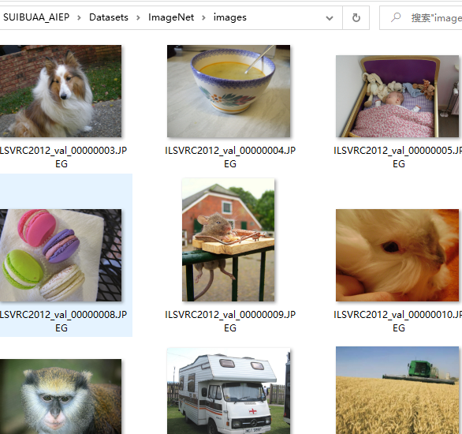

数据集介绍
==========

目前本项目已集成两种数据集，分别是Cifar10数据集，ImageNet数据集及ImageCustom数据集。

Cifar10数据集
-------------

目前项目提供的Cifar10数据集，采用的是npy格式存储，特点是共有10个类别，且保证均匀分布，每种类别数目一致。用户也可以自行生成，但是要求
label的格式是 one_vector类型如下：

::

   ys_pred_adv [0 0 0 1 0 0 0 0 0 0]
   ys_pred_adv [1 0 0 0 0 0 0 0 0 0]
   ys_pred_adv [0 0 0 0 0 1 0 0 0 0]
   ...
   ys_pred_adv [0 0 1 0 0 0 0 0 0 0]

Cifar10数据集下载链接
~~~~~~~~~~~~~~~~~~~~~

::

   http://www.cs.toronto.edu/~kriz/cifar-10-python.tar.gz

Cifar100数据集下载链接
~~~~~~~~~~~~~~~~~~~~~~

::

   http://www.cs.toronto.edu/~kriz/cifar-100-python.tar.gz

npy格式生成
~~~~~~~~~~~

npy生成的方式可以参考代码 cifartonpy.py：

::

   AISafety
   ├── EvalBox
   ├── Models
   ├── utils
   ├── test
   │   ├── testimport.py
   │   ├── testimport_black.py
   │   ├── cifartonpy.py
   ├── Datasets

ImageNet数据集
--------------

数据以图片方式保存，对应给出一个图像样本名称和类别号的文件用于做输入

ImageNet数据集图像
~~~~~~~~~~~~~~~~~~

|image1|

ImageNet数据集标签文件
~~~~~~~~~~~~~~~~~~~~~~

以~/AISafety/Datasets/ImageNet/val_10.txt文件为例：

::

   ILSVRC2012_val_00000001.JPEG 65
   ILSVRC2012_val_00000002.JPEG 970
   ILSVRC2012_val_00000003.JPEG 230
   ...
   ILSVRC2012_val_00000010.JPEG 109

ImageNet数据集类别字典
~~~~~~~~~~~~~~~~~~~~~~

ImageNet数据集类别字典如下所示：

::

   {
   0: "tench Tinca tinca",
   1: "goldfish. Carassius auratus",
   ...
   27: "eft",
   ...
   }

ImageCustom数据集
-----------------

该数据集用于商品攻击功能模块。数据集与ImageNet数据集格式类似。

