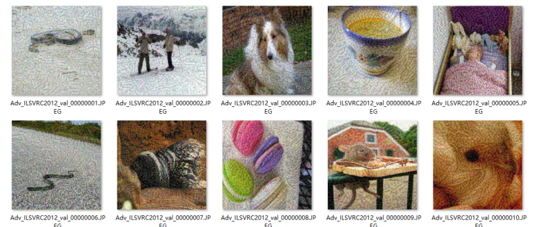

完整集成调用过程
================

接口文件存储位置
----------------

平台已集成有完整的攻击评测接口文件testimport.py。接口文件路径如下：

::

   ├── EvalBox
   ├── Models
   ├── utils
   ├── test
       ├── **testimport.py**
   ├── Datasets

接口文件参数参考
----------------

如下为在cifar-10数据集上，执行一个完整攻击+评测过程，所使用的对应参数：

.. code:: python

   parser = argparse.ArgumentParser(description='The Attack and Evaluate Generation')
   # common arguments
   parser.add_argument(
       '--attack_method',
       type=str,
       nargs='*',
       default = ["FGSM"])
   parser.add_argument(
       '--evaluation_method',
       type=str,
       default='ACC')
   parser.add_argument(
       '--Data_path',
       type=str,
       nargs='*',
       default=["../Datasets/cln_data/cifar10_300_origin_inputs.npy", "../Datasets/cln_data/cifar10_300_origin_labels.npy",                     "../Datasets/cln_data/cifar10_300_origin_inputs.npy", "../Datasets/cln_data/cifar10_300_origin_labels.npy"])
   parser.add_argument(
       '--Dict_path',
       type=str,
       default="./dict_lists/cifar10_dict.txt")
   parser.add_argument(
       '--defense_model',
       type=str,
       default='Models.UserModel.ResNet2')
   parser.add_argument(
       '--model',
       type=str,
       default = 'Models.UserModel.FP_resnet')
   parser.add_argument(
       '--model_dir',
       type=str,
       default = '../Models/weights/FP_ResNet20.th')
   parser.add_argument(
       '--model_defence_dir',
       type=str,
       default='../Models/weights/resnet20_cifar.pt')
   parser.add_argument(
       '--IS_COMPARE_MODEL',
       type=bool,
       default=False)
   parser.add_argument(
       '--IS_TARGETTED',
       type=bool,
       default=False)
   parser.add_argument(
       '--data_type',
       type=str,
       default='cifar10')
   parser.add_argument(
       '--IS_WHITE', type=bool, default=True)
   parser.add_argument(
       '--IS_PYTHORCH_WHITE', type=bool, default=False)
   parser.add_argument(
       '--IS_DOCKER_BLACK', type=bool, default=False)
   parser.add_argument(
       '--black_Result_dir' ,
       type=str,
       default = ' ')
   parser.add_argument(
       '--IS_SAVE',
       type=bool,
       default=False)
   parser.add_argument(
       '--save_path',
       type=str,
       default='./Attack_generation/')
   parser.add_argument(
       '--save_method',
       type=str,
       default='.npy')
   parser.add_argument(
       '--Scale_ImageSize',
       type=int,
       default=32)
   parser.add_argument(
       '--Crop_ImageSize',
       type=int,
       default=32)
   parser.add_argument(
       '--batch_size', type=int, default=2, help='batch size')
   parser.add_argument(
       '--CAM_layer',
       type=int,
       default=12)
   parser.add_argument(
       '--GPU_Config',
       type=str,
       # 数目，index设置
       default=["2","0,1"])
   parser.add_argument(
       '--save_visualization_base_path',
       type=str,
       default='./temp/')
   arguments = parser.parse_args()
   main(args=arguments)

接口文件参数说明
----------------

attack_method
~~~~~~~~~~~~~

该参数表示攻击算法名称，目前平台已集成的所有攻击算法，均可通过缩写调用。

参考格式为： [“FGSM”]、[“PGD”]、[“DEEPFOOL”]

evaluation_method
~~~~~~~~~~~~~~~~~

该参数表示评测算法名称，目前平台已集成的所有评测算法，均可通过缩写调用。

参考格式为： [“ACC”]、[“ALDp”]

Data_path
~~~~~~~~~

该参数共有4个参数位，分别需传入：

1. 样本的数据集文件
   （白盒攻击下是原始样本，黑盒攻击下是攻击后的攻击样本）

2. 对应的标签的文件 （非目标攻击下是Ground
   Truth，目标攻击下是攻击目标类别）

3. 原始样本的数据集文件

4. 对应的Ground Truth标签文件

参考格式为：

[“../Datasets/”]

Dict_path
~~~~~~~~~

该参数表示所选择的数据集文件所对应的字典文件。字典文件中应包含对应的数据集的分类类别号码和类别名称的编号

参考格式为“./dict_lists/cifar10_dict.txt”

以上述参考格式中cifar10_dict.txt文件为例，字典文件形如：

::

   {'0': 'airplane', '1': 'automobile', ... , '8': 'ship', '9': 'truck'}

model
~~~~~

该参数表示用户选择的待执行评测任务的网络模型。使用时需给出模型地址。

参考格式： ‘Models.UserModel.ResNet2’

model_dir
~~~~~~~~~

该参数表示用户选择的待执行测评任务的网络模型的参数文件，对应着上述model参数中模型文件。使用时使用相对地址调用。

参考格式：‘../Models/weights/resnet20_cifar.pt’

defense_model
~~~~~~~~~~~~~

default = ‘Models.UserModel.ResNet2’

该参数表示用户选择的防御后模型。与model参数类似，区别在于只有在使用对比评测算法时，才传入该参数，并设定IS_COMPARE_MODEL参数为True。

参考格式： ‘Models.UserModel.ResNet2’

model_defence_dir
~~~~~~~~~~~~~~~~~

default=‘../Models/weights/resnet20_cifar.pt’

该参数表示用户选择的防御后模型的参数文件。与model_dir参数类似，区别在于只有在使用对比评测算法时，才传入该参数，并设定IS_COMPARE_MODEL参数为True。

参考格式：‘../Models/weights/resnet20_cifar.pt’

IS_COMPARE_MODEL
~~~~~~~~~~~~~~~~

该参数默认设置False，如果需要比较两个不同模型的话，设置为True

目前平台已集成的，可用于比较两个模型的评测方法有：CCV，CAV，COS，CRR，CSR

IS_TARGETTED
~~~~~~~~~~~~

该参数表示使用的数据是否是目标攻击，False是非目标攻击，True是目标攻击方法

对于不同的选择，用户需提供相应的预处理数据集并传入对应位置。

data_type
~~~~~~~~~

default=“cifar10”，‘ImageNet’，[‘ImageNet’, “withoutNormalize”]

该参数表示数据集的类型，目前平台共支持三种数据集：

1. ‘cifar10’
2. ‘ImageNet’
3. [‘ImageNet’, “withoutNormalize”]

用户可根据实际需要注明类型，以方便预处理过程，另外使用ImageNet类型相似的数据一般不是原始的ImageNet数据集，选用[‘ImageNet’,
“withoutNormalize”]时候，不对图像做归一化，用户自行预处理

IS_WHITE
~~~~~~~~

该参数表示攻击样本的生成是否经过平台提供的正在使用的攻击方法，默认
True，即是通过攻击算法生成的，（攻击算法可以是白盒的方式，也可以是黑盒的方式，具体实现由用户添加黑盒的模拟梯度），False的时候，输入的样本应当是其他攻击算法训练生成得到的，可以直接用平台的测评过程对模型进行评测

IS_PYTHORCH_WHITE
~~~~~~~~~~~~~~~~~

该参数表示评测过程是否要用到模型信息，目前平台已集成评测算法中，BD，RGB，RIC这三个评测方法，默认需要模型信息，是设定为True，其余算法均需设定为False。

黑盒模式下，默认不需要模型信息，始终设定为False

IS_DOCKER_BLACK
~~~~~~~~~~~~~~~

该参数表示是否使用Docker执行黑盒测试。在白盒方式下面，该参数默认设置False，在黑盒方式下，可将该参数设置为True，并通过外来数据（其他平台或者docker黑盒的结果）获取预测的结果

ONLY_GENRATE_BLACK_SAMPLE
~~~~~~~~~~~~~~~~~~~~~~~~~

该参数表示是否仅采用黑盒样本。设置为True的时候，只用平台产生对应的攻击样本，并保存在save_path
下面的路径中。得到的结果供黑盒的平台使用。

设置为True时，只生成得到攻击样本，供用户使用到其他平台。

l 在其他平台使用本平台的攻击样本和原始数据获得预测结果，并获得测评结果

–ONLY_GENRATE_BLACK_SAMPLE 设置为False

–IS_DOCKER_BLACK 同时设置为True

用户使用原始的数据集和平台生成的样本，预测结果从他处获取，再计算测评指标

格式说明：

分为 json和npy格式的，json格式的例如FGSM的原始数据是

（30,3,32,32）和对应的标签是(30,10)格式，那么输出用于其他黑盒平台的数据也是一样的格式。

+---+---------------------------------+---------------------------------+
| 参 | 描述                           | 示例                            |
| 数 |                                |                                 |
+===+=================================+=================================+
| B | 原数据集路径。用户需            | npy数据集：/dataset/ba          |
| D | 要获得路径下面的子目录，子目录  | sePath/1/inputs.npyJson数据集： |
| P | 下为数据集，名称固定为inputs.\* | /dataset/basePath/1/inputs.json |
| a | (格式支持npy和                  |                                 |
| t | json两种；json格式的key为data)  |                                 |
| h |                                 |                                 |
+---+---------------------------------+---------------------------------+
| C | 攻击数据集路径。用户需要        | 以fgsm算法为                    |
| D | 获得路径下面的子目录，子目录下  | 例：npy数据集：/dataset/childP  |
| P | 通常又存在多个二级目录，此二级  | ath/1/fgsm_01/inputs.npy/datase |
| a | 目录需要保存下来，作为返回结果  | t/childPath/1/fgsm_02/inputs.np |
| t | 的key，每个二级目录下会有对应的 | yJson数据集：/dataset/childPath |
| h | 攻击数据集，名称固定为inputs.\* | /1/fgsm_01/inputs.json/dataset/ |
|   | (格式支持npy和json两种；json格  | childPath/1/fgsm_02/inputs.json |
|   | 式的key为data)对应我们保存输出  |                                 |
|   | 的Attack_generation中的攻击样本 |                                 |
+---+---------------------------------+---------------------------------+
| R | 结果保存路径。                  | /result                         |
| E | 用户需要将结果以json的格式保存  |                                 |
| S | 到该目录下,就是black_Result_dir |                                 |
| P | 上面设置的数据                  |                                 |
| a |                                 |                                 |
| t |                                 |                                 |
| h |                                 |                                 |
+---+---------------------------------+---------------------------------+

black_Result_dir
~~~~~~~~~~~~~~~~

该参数表示黑盒测试的中间结果存储路径。在白盒方式下面，该参数默认设置’
’空，黑盒会设置具体数据的路径。以FGSM+cifar10_30数据集为例，返回结果的格式如下：

.. code:: json

   {
       "model":{
           "BDResult": Array[30],
           "CDResult": {
               "fgsm_01": Array[30],
               "fgsm_02": Array[30]
           }
       },
       "compare_model": {
           "BDResult": Array[30],
           "CDResult": {
               "fgsm_01": Array[30],
               "fgsm_02": Array[30]
           }
       }
   }

以上结果具体键值说明：

+---------+-------------+----------------------------------------------+
| Key     | 名称        | 说明                                         |
+=========+=============+==============================================+
| model   | 原始模      | 原始模型预测结果放置在该Key下                |
|         | 型预测结果  |                                              |
+---------+-------------+----------------------------------------------+
| compar  | 对比模      | 对比模型预测结果放置在该Key下                |
| e_model | 型预测结果  |                                              |
+---------+-------------+----------------------------------------------+
| B       | 原数        | 因为                                         |
| DResult | 据预测结果  | 原始数据集仅有一个，所以结果放在该Key下即可  |
+---------+-------------+----------------------------------------------+
| C       | 对抗数      | 项目中的攻击算法                             |
| DResult | 据预测结果  | 预存有若干参数。如FGSM算法预设两个参数组合f  |
|         |             | gsm_01和fgsm_02。该Key下以二元字典的形式存储 |
+---------+-------------+----------------------------------------------+
| fgsm    | 对抗数据    | 以FGSM为例，该key为用户解析攻击数            |
|         | 集预测结果  | 据集保存的上级目录，预测结果需要与该key对应  |
+---------+-------------+----------------------------------------------+

IS_SAVE
~~~~~~~

该参数表示是否保存生成的攻击样本，True则保存攻击后的样本和对攻击样本的预测值，和原始预测值，格式和输入的一致，npy类型的还是npy，ImageNet类型的还是图片和类别列表文件。

ImageNet的攻击后的样本和预测类别会存在指定的路径下

save_path
~~~~~~~~~

该参数用于给出存储攻击结果的具体路径

如果使用的是形如cifar10的npy格式数据集，则最终存储形如以下目录树：

::

   AISafety
   ├── EvalBox
   ├── Models
   ├── utils
   ├── test
   │   ├── Attack_generation
   │   │   ├── attack_param_FGSM_fgsm_01
   │   │   │   ├──FGSM_30_adv_preds_labels.json
   │   │   │   ├──FGSM_30_adv_preds_labels.npy   # 对抗预测标签
   │   │   │   ├──FGSM_30_advs.json
   │   │   │   ├──FGSM_30_advs.npy     # 对抗样本
   │   │   ├── attack_param_FGSM_fgsm_02
   ├── Datasets

如果使用的是形如ImageNet的原始图像格式数据集，则最终存储形式，为攻击图像和标签。如将save_path设置为“ImageNet_Attack_generation/”
。则攻击成功后会在该路径下生成形如下方的目录树：

::

   AISafety
   ├── EvalBox
   ├── Models
   ├── utils
   ├── test
   │   ├── Attack_generation
   │   │   ├── attack_param_FGSM_fgsm_01
   │   │   ├── attack_param_FGSM_fgsm_02
   │   │   │   ├── Adv_Images  # 对抗图像
   │   │   │   │   ├── Adv_ILSVRC2012_val_00000001.JPEG
   │   │   │   │   ├── Adv_ILSVRC2012_val_00000002.JPEG
   │   │   │   │   ├── ...
   │   │   │   │   ├── Adv_ILSVRC2012_val_00000010.JPEG
   │   │   │   ├── adv_preds_val_10.txt   # 对抗样本标签
   │   │   │   ├── origins_val_10.txt   # 原始样本标签
   ├── Datasets

攻击后的样本图像将被放在Adv_Images中，如图所示：

|image1|

adv_preds_val_10.txt和origins_val_10.txt文件中内容形如：

::

   Adv_ILSVRC2012_val_00000001.JPEG 69
   Adv_ILSVRC2012_val_00000002.JPEG 970
   ...
   Adv_ILSVRC2012_val_00000010.JPEG 669

save_method
~~~~~~~~~~~

该参数表示若用户选择保存对抗攻击样本时，使用那种格式存储相应样本。默认是npy，numpy格式的，保存结果例如上述，如果设置是’ImageNet’就例如上述所示图片方式保存

参考格式为：“.npy”

Scale_ImageSize
~~~~~~~~~~~~~~~

该参数表示归一化尺寸。cifar10，cifar100
默认到32,ImageNet推荐归一化到224X224
同时也支持用户自定义，用户自行决定放缩到多少后再裁减

参考格式：（32,32）、（224,224）

Crop_ImageSize
~~~~~~~~~~~~~~

该参数表示用户定义好缩放尺寸后，进行裁减的尺寸

参考格式：（32,32）、（224,224）

batch_size
~~~~~~~~~~

该参数表示数据每次批量处理的数目，仅用于攻击算法生成对抗样本阶段使用。

参考格式：64

CAM_layer
~~~~~~~~~

该参数表示可视化热力图的过程中，设置展示敏感和feature的第几层。

参考格式：28

GPU_Config
~~~~~~~~~~

该参数表示项目使用GPU设置。第一个值表示，GPU的数目，第二个表示可以使用的GPU的编号，目前支持，在判断和实际设备中信息一致的设备中任意选取一个使用。

参考格式：[“2”,“0,1”]。释义：共有2个GPU，编号为0和1，调用时程序会随机选择GPU使用。

save_visualization_base_path
~~~~~~~~~~~~~~~~~~~~~~~~~~~~

该参数表示计算的评测结果和可视化的存储根目录的设置路径。

参考格式：‘./temp/’

以下为执行评测后相应的temp路径结果：topk是模型预测使用攻击前后的样本的一个预测概率前k的一个比较，

对应的如果是ImageNet下面数据可视化结果还会生成热力图，详情请参阅可视化展示部分内容。

::

   SUIBUAA_AIEP
   ├── EvalBox
   ├── Models
   ├── utils
   ├── test
   │   ├── temp
   │   │   ├── FGSM
   │   │   │   ├──fgsm01
   │   │   │   │   ├──topk
   │   │   │   │   ├──AttackSample_torchvision.models.vgg16_cam_0.jpg
   │   │   │   │   ├──....jpg
   │   │   │   ├──fgsm02
   │   │   │   ├──...
   │   │   ├── result.txt
   │   ├── attack_param
   ├── Datasets

接口文件调用流程
----------------

设置好上述所有参数后，执行

::

   python testimport.py

即可运行接口，并在控制台实时获取项目运行进度，以及相应的评测结果。

