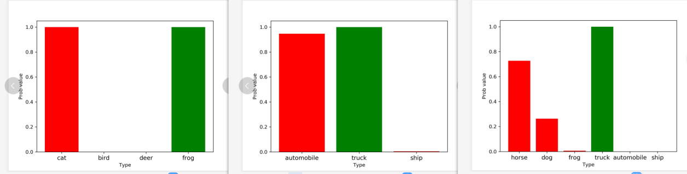
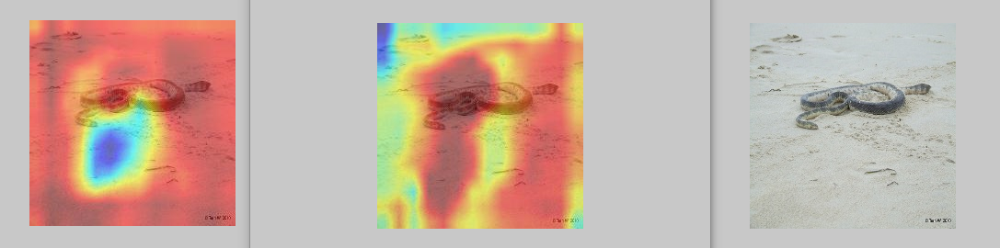

评测完整实例
============

参考实例1（白盒攻击）
---------------------

参数设置
~~~~~~~~

testimport.py中parser设置：

.. code:: python

   (   attack_method=["FGSM"],       
       evaluation_method='ACTC', 
       Data_path=["../Datasets/ImageNet/images/","../Datasets/ImageNet/val_4.txt","../Datasets/ImageNet/images/","../Datasets/ImageNet/val_4.txt"],
       Dict_path="./dict_lists/ImageNet_12_dict.txt",
       model_dir=' ', 
       model='torchvision.models.vgg19', 
       defense_model=' ', 
       model_defence_dir=' ', 
       data_type='ImageNet',
       IS_WHITE=True,
       IS_PYTHORCH_WHITE=False,
       black_Result_dir=' ',
       IS_SAVE=True,
       IS_COMPARE_MODEL=False,
       Scale_ImageSize=(375,500),
       Crop_ImageSize=(375,500),
       IS_TARGETTED=False,
       save_path='ImageNet_Attack_generation/'，
       batch_size=64, 
       CAM_layer=28,
       GPU_Config=["1","0"],
       save_method='ImageNet'
       save_visualization_base_path="./temp/"
   )

输出存储
~~~~~~~~

项目会默认生成对应名称的结果位置如下：

::

   AISafety
   ├── EvalBox
   ├── Models
   ├── utils
   ├── test
   │   ├── testimport.py
   │   ├── testimport_black.py
   │   ├── ImageNet_Attack_generation
   │    │   ├── attack_param_FGSM_fgsm_01
   │    │   ├── attack_param_FGSM_fgsm_02  # 对应于攻击算法参数
   │    │   │   ├── Image
   │    │   │   │   ├── Adv_Images  # 存储对抗样本
   │    │   │   │   │   ├── Adv_ILSVRC2012_val_00000001.JPEG
   │    │   │   │   │   ├── Adv_ILSVRC2012_val_00000002.JPEG
   │    │   │   │   │   ├── Adv_....JPEG
   │    │   │   │  ├── adv_preds_val_4.txt
   │    ├── temp
   │    │   ├── **result.txt** # 用于存储评测结果
   ├── Datasets

评测结果
~~~~~~~~

result.txt中存储的评测计算结果形如：

.. code:: json

   {
       "table_list": {
           "FGSM": {
               "fgsm_01": [["ACAC", "ACC", "ACAC", "ACTC"], [0.8877955079078674, 0.9, 0.26380638033151627, 0.025149270360998344]], 
               "fgsm_02": [["ACAC", "ACC", "ACAC", "ACTC"], [0.8242363157095732, 0.9, 0.23616972751915455, 0.014533321653289022]]
           }
       }
   }

这里是使用Json格式的存储。格式说明如下：

第一个字典关键字是FGSM，表示攻击的方法，第二个是fgsm_01，表示配置的参数文件对应的名称，“ACAC”,
“ACC”等表示的是评测函数的选取，后面顺序相同的对应的是该方法的评测值

“0.8877955079078674,
0.9”,这里设置的评测方法是“ACTC”，对应的就是最后一个值0.025149270360998344

攻击后样本
~~~~~~~~~~

攻击后样本，如果选择的保存样本方式为

::

   save_method='ImageNet'

而非

::

   save_method='.npy'

则对抗样本将以图像形式，存储在先前设置的“Adv_Images”中

攻击前后模型topk对比
~~~~~~~~~~~~~~~~~~~~

模型评测的同时，将就模型预测topk类别做统计，并给出如下图像：

|image1|

攻击前后热力图敏感区域可视化
~~~~~~~~~~~~~~~~~~~~~~~~~~~~

模型评测的同时，将生成模型关注度的热力图，并将按照

1. 原始图像，OriginSample_模型名_orig_图像序号.jpg

2. 攻击图像，AttackSample_模型名_orig_图像序号.jpg

3. 原始图像热力图，OriginSample_模型名_cam_图像序号.jpg

4. 攻击图像热力图，AttackSample_模型名_cam_图像序号.jpg

的形式，一张输入样本，对应输出四张可视化图像。

目前的热力图方法只支持grad_cam的方式，指定显示模型的某一层到图像上，默认结果和热力图设置和保存成224X224的，可以供用户作为可解释性分析的一种方式。

|image2|

参考示例2（黑盒攻击）
---------------------

.. _参数设置-1:

参数设置
~~~~~~~~

testimport_black.py中parser设置，arg1的：

::

   (
       attack_method=["FGSM"],       
       Data_path=
       ["../Datasets/CIFAR_cln_data/cifar10_30_origin_inputs.npy", "../Datasets/CIFAR_cln_data/cifar10_30_target_labels.npy",
       "../Datasets/CIFAR_cln_data/cifar10_30_origin_inputs.npy", "../Datasets/CIFAR_cln_data/cifar10_30_origin_labels.npy"],
       Dict_path="./dict_lists/cifar10_dict.txt",
       model_dir='../Models/weights/FP_ResNet20.th',
       model='Models.UserModel.FP_resnet',
       defense_model='Models.UserModel.ResNet2', 
       model_defence_dir='../Models/weights/resnet20_cifar.pt', 
       IS_COMPARE_MODEL=True,
       IS_TARGETTED=True,
       data_type='cifar10',
       IS_WHITE=True,
       IS_PYTHORCH_WHITE=False,
       IS_DOCKER_BLACK=True,
       ONLY_GENRATE_BLACK_SAMPLE=False,
       IS_SAVE=False,
       black_Result_dir="../Datasets/adv_data/zjx.json",
       Scale_ImageSize=(32,32),   (高，宽）
       Crop_ImageSize=(32,32),(高，宽）
       batch_size=64, 
       save_path='./Attack_generation/'，
       GPU_Config=["1","0"],
       save_method='.npy'
   )

testimport_black.py的parser设置，arg2的：

::

       data_type='cifar10',
       evaluation_method='CCV',
       IS_COMPARE_MODEL=True,
       IS_TARGETTED=True,
       IS_PYTHORCH_WHITE=False,
       CAM_layer=12
       save_visualization_base_path="./temp/"
   )

.. _输出存储-1:

输出存储
~~~~~~~~

项目会默认生成对应名称的结果位置如下：

::

   AISafety
   ├── EvalBox
   ├── Models
   ├── utils
   ├── test
   │   ├── temp
   │    │   ├── FGSM
   │    │   │   ├── fgsm_01
   │    │   │   │   ├── topk
   │    │   │   │   │   ├── top_3_0_FGSM_ Models.UserModel.FP_resnet_cifar10.jpg
   │    │   │   │   │   ├── top_3_1_FGSM_ Models.UserModel.FP_resnet_cifar10.jpg
   │    │   │   │   │   ├── top_3_..._FGSM_ Models.UserModel.FP_resnet_cifar10.jpg
   │    │   │   │   │   ├── top_3_0_FGSM_ Models.UserModel.ResNet2_cifar10.jpg
   │    │   │   │   │   ├── top_3_..._FGSM_ Models.UserModel.ResNet2_cifar10.jpg
   │    │   │   │   │   ├── ....jpg
   │    │   ├── result.txt
   │   ├── Attack_generation
   ├── Datasets

.. _评测结果-1:

评测结果
~~~~~~~~

result.txt中存储的评测计算结果形如：

.. code:: json

   {
       "table_list": {
           "FGSM": {
               "fgsm_01": [["ACAC", "ACC", "ACAC", "ACTC"], [0.8877955079078674, 0.9, 0.26380638033151627, 0.025149270360998344]], 
               "fgsm_02": [["ACAC", "ACC", "ACAC", "ACTC"], [0.8242363157095732, 0.9, 0.23616972751915455, 0.014533321653289022]]}
       }
   }

这里是使用Json格式的存储。格式说明如下：

第一个字典关键字是FGSM，表示攻击的方法，第二个是fgsm_01，表示配置的参数文件对应的名称，“ACAC”,
“ACC”等表示的是评测函数的选取，后面顺序相同的对应的是该方法的评测值

“0.8877955079078674,
0.9”,这里设置的评测方法是“ACTC”，对应的就是最后一个值0.025149270360998344

每测评一次会在文件中按照
攻击方法–>方法配置文件名字–>测评方法–>结果值去保存

如果不想被之前的结果干扰，用户可以手动删除，只生成当前的结果即可。

.. _攻击前后模型topk对比-1:

攻击前后模型topk对比
~~~~~~~~~~~~~~~~~~~~

这里topk默认是3，会默认生成对应名称的结果，表示攻击前后模型对样本预测的概率前3的分类结果的一个柱状图比较。

对应的命名方式例如： top_3_0_FGSM_Models.UserModel.FP_resnet_cifar10.jpg

表示top3在第0个样本攻击方法FGSM使用的模型文件Models.UserModel.FP_resnet在数据集cifar10的一个柱状分类前三的结果图

项目默认保存的是样本数据的前50%，用户可以通过修改
testimport.py中Save_Eval_Visualization_Result()函数的topl_show_list参数，此参数是一个列表，用户可手动赋值，也可以按照自己的需求生成要保存的数据的index列表

::

   topk_show_list = [0,1]
   topl_show_list=topk_show_list设置要保存的列表

